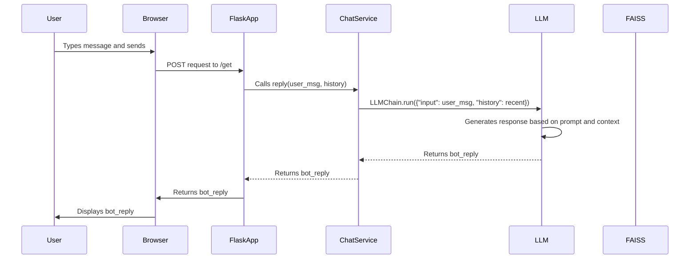

# Poultry Assistant

This project is a Flask-based chatbot designed to assist poultry farmers in understanding and managing poultry diseases. It leverages a language model (LLM) to answer user questions based on a veterinary manual. The application uses Google's Gemini Pro model for generating responses and FAISS for storing and retrieving relevant information from a knowledge base of PDF documents.

## Key Features

- **Chat Interface:** A user-friendly interface built with Flask and HTML/CSS.
- **Contextual Responses:** Uses conversation history to provide more relevant answers.
- **Knowledge Base:** Uses FAISS index created from PDF documents related to poultry diseases.
- **Google Gemini Pro:** Utilizes the `gemma-3-12b-it` model for generating responses.

## Usage

1. **Setup Environment Variables:**
   Set the `GOOGLE_API_KEY` environment variable.
2. **Install Dependencies:**

   ```bash
   pip install -r requirements.txt
   ```
3. **Run the Application:**

   ```bash
   python app.py
   ```

## Architecture

The application follows a simple architecture:

- **app.py:** Contains the Flask application and defines the routes for the chat interface.
- **chat.py:** Implements the `ChatService` class that handles the interaction with the LLM.
- **database.py:** Manages the FAISS vector store, including creating and loading the index.
- **model.py:** Provides functions to initialize and retrieve the LLM and embeddings.
- **templates/chat.html:** Defines the HTML template for the chat interface.
- **static/style.css:** Contains the CSS styles for the chat interface.


